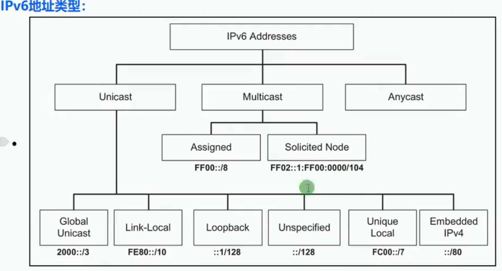
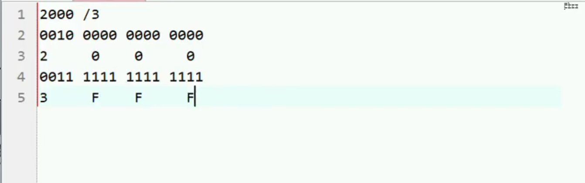
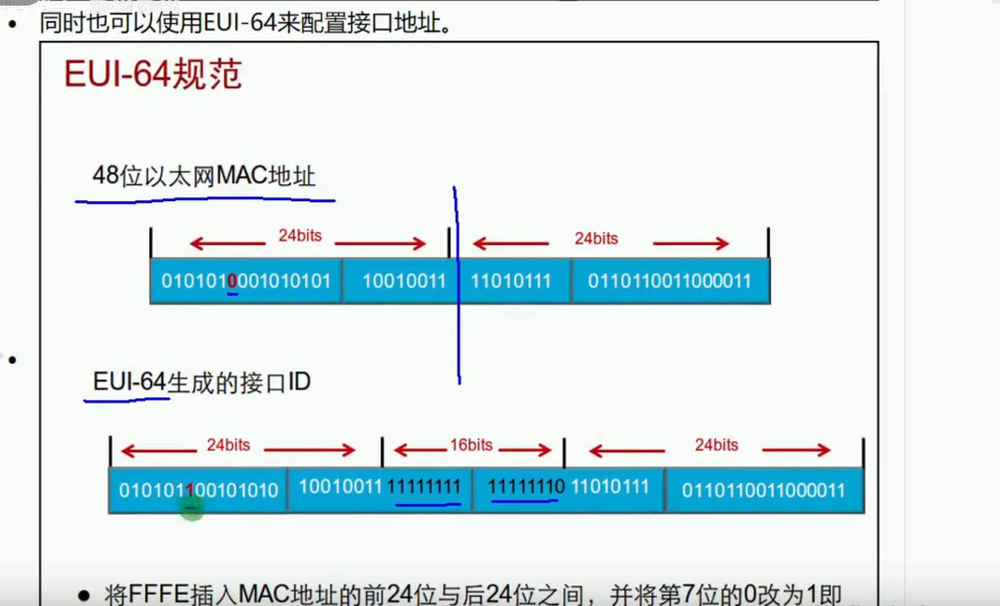
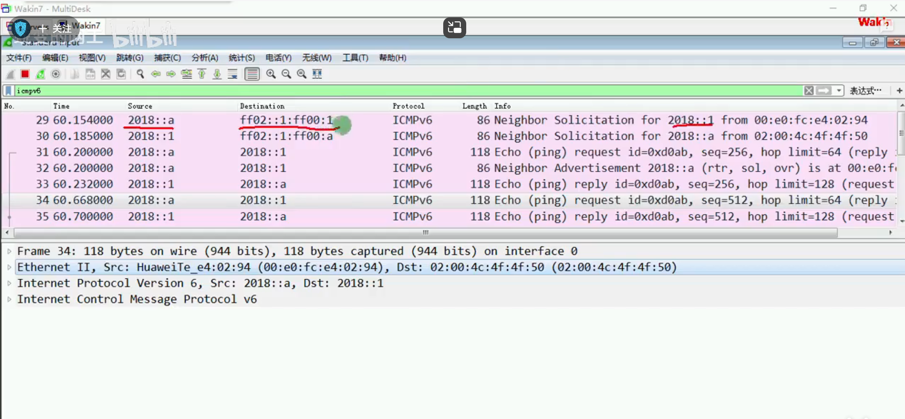
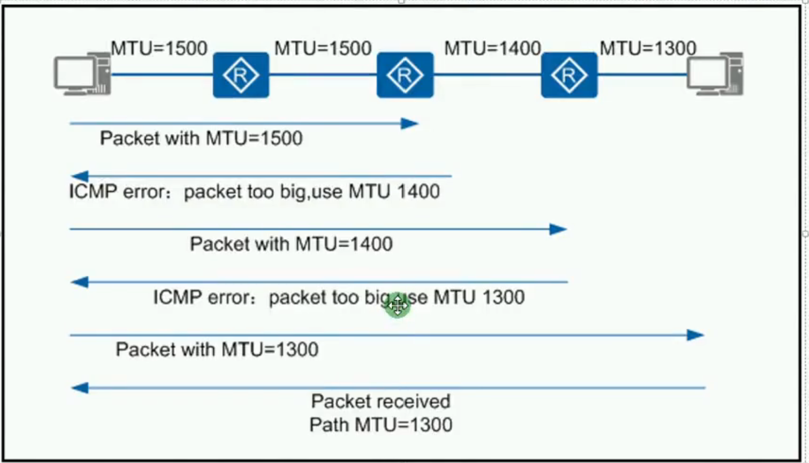

学习地址
   https://ispip.clang.cn/
   https://www.bilibili.com/video/BV1ct4y1E7q3?spm_id_from=333.788.player.switch&vd_source=f0b6e7714bdfad8ed361cf92c22b5d72&p=2
<br>
IPv6多源技术
一个接口可以配置多个IP地址
一个接口配置IPv4可以配置一个主地址和多个辅助地址。当配置ospf或者rip时使用主地址。
IPv6没有主地址和辅助地址，华为设备最多配置10个IPv6地址。

IPv6没有广播如何 实现MAC地址与IPv6地址对应。也就是IPv6的arp？
~~~bash
netsh interface ipv6 show neighbors
~~~
过度技术：
双栈
隧道
转换

IPv6报文结构：
不用分片了：1500 1400mtu值没有了。减轻了中间设备的负载。

IPv6用8组每组4位十六进制表示，共128位二进制。128位分成8组，每组16位。一个4位2进制表示一位十六进制。2^16=65536=FFFF

IPv6地址压缩格式
每组开头的0可以省略。
连续为0的组可以使用“::”代替，但是只能使用一次。

  

全球单播地址:前三位不变，按照2000：：/3定义就是 2或者3开头
  

```
EUI-64 扩展唯一标识符
开启IPv6或配置全球单播地址后，接口会采取EUI-64规范自动生成一个链路本地地址，生成的规则如下：
1.在MAC地址中间部分插入FF:FE 是一个48位的MAC地址变成一个64位的地址
2.MAC地址从左到右的第七位进制反转（0变1，1变0）
  


mac地址的第7位 1表示唯一、0表示不唯一。
就是mac可以和mac地址关联。windows系统为了安全已经将这个规则改为随机生成。可以通过命令变成不随机
netsh interface ipv6 set global randomizeidentifiers=disable

```
基础配置
|方式|地址前缀|网关|DNS|备注|
|:-|:-|:-|:-|:-|
|静态|手动|手动|手动|
|SLAAC|RS和RA|RS和RA|无|M=0、O=0|
|Stateful DHCPv6|DHCPv6|DHCPv6|DHCPv6|M=1|
|Stateless DHCPv6|RS和RA|RS和RA|DHCPv6|M=0、O=1|

注：M=0 地址前缀和网关是无状态获得，M=1DHCP获得
O=1 DNS由DHCP获得 0没有DNS无状态地址自动分配的方式无法获得DNS

SLAAC Stateless Address Autoconfiguration,无状态地址自动配置

## IPv6地址发现技术
 通过NS NA 报文实现ARP、DAD（重复地址检测）功能
|类型|备注|
|:-|:-|
|NS|Neighbor Solicitation 邻居请求，类似IPv4中的ARP请求报文|
|NA|Neighbor Advertisement 邻居通告，类似APR应答报文|

Solicited Node:请求节点，开头FF02::1:FF00/104,加上单播地址最后24位。
这个就是实现了“广播”功能。IPv4向FFFF 发请求 ，IPv6没有广播，这个地址是在配置全球单播后自动加入到 请求节点组播组（FF02::1:FF00/104）。就是如果被ping地址，如果在线必然 会在由它后24位生成的 组播里。这里有个设计bug这个是有可能重复的。

  


## IPv6路由器发现技术：
通过RS和RA 技术实现无状态地址自动配置，无需DHCPv6。

华为设备默认关闭Ra功能，思科默认开启。
RS是想PC设置成自动获取时向外发送请求的包
RA是路由收到RS包回复的包，路由设备也会周期发送RA包
命令如下：
~~~bash
undo ipv6 nd ra halt
~~~
pc会获得路由前准和 EUI-64生成的单播地址。网关是 路由的本地链路地址。

## Path MTU
发现传输路径上最小MTU，然后按照最小的MTU 发送包。（IPv6途中不允许切片，所以当遇到MTU小的时候就ICMP返回错误类型2 too big 直到MTU匹配到最小）
  

## NDP 配置
|命令|备注|
|:-|:-|
|undo ipv6 nd ra halt|开启接口RA报文功能，默认关闭|
|ipv6 nd ra min-interval 100|配置RA最小间隔，默认200S|
|ipv6 nd ra max-interval 200|配置RA最大间隔，默认600S|

## NDP 邻居状态跟踪
## DUID DHCPv6 Unique Identifier 设备唯一标识符
每个DHCPv6服务器和客户端有且只有一个DUID用来识别彼此。
DUID采用两种方式生成：
LL:采用链路层地址方式生成DUID。MAC地址生成，华为默认的方式
LLT：采用链路层地址和时间组合方式生成DUID。MAC地址加时间，微软默认的方式

是否可以用？
dis dhcpv6 duid 判断设备是否支持 DHCPV6 服务端

## DHCPv6配置
~~~
dhcpv6 pool serverpool
address prefix 2400:1234::/64
excluded-address 2400：1234::1 to 2400：1234::9 
dns-server 2000::5
~~~
接口模式下
~~~
int g0/0/1
dhcpv6 server serverpool
~~~
查看已分配地址
dhcpv6 pool serverpool binding